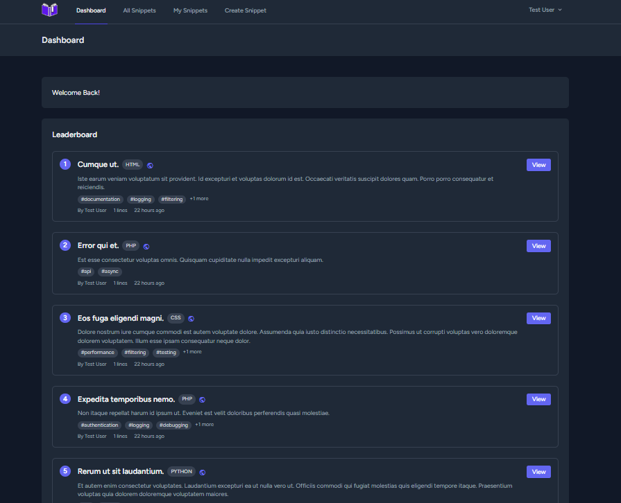
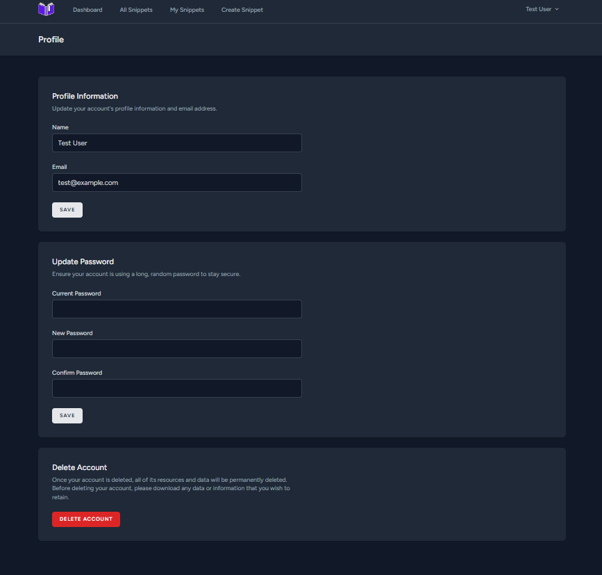
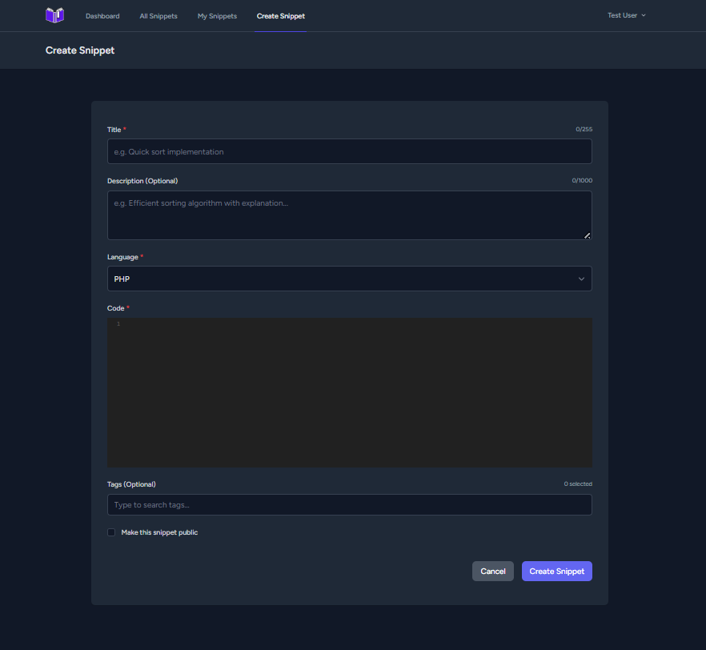
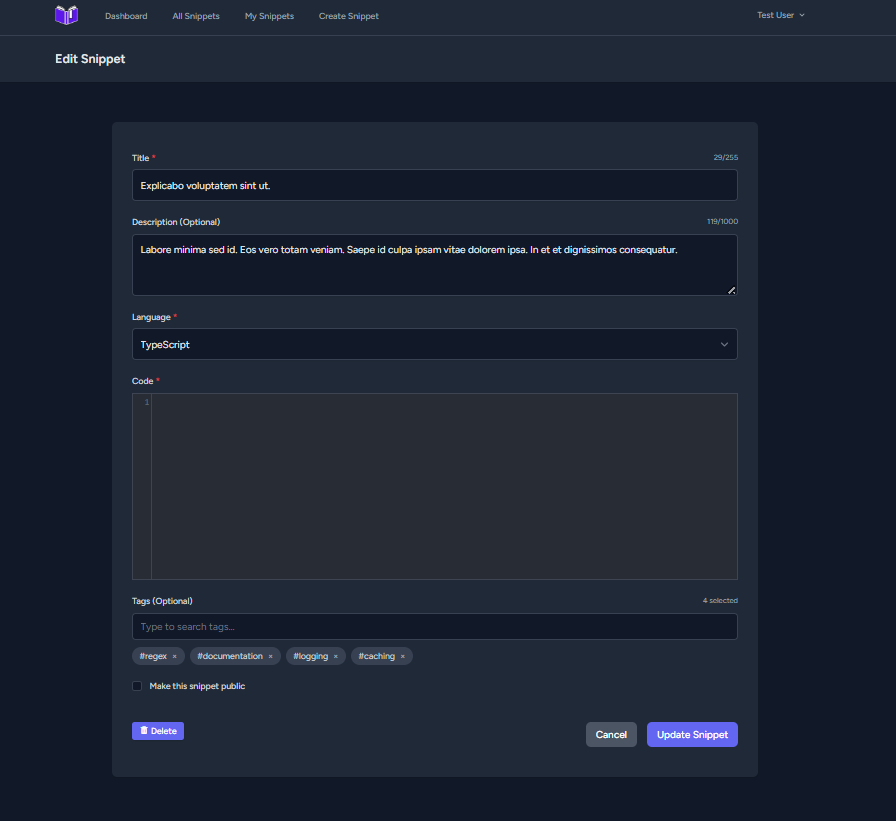
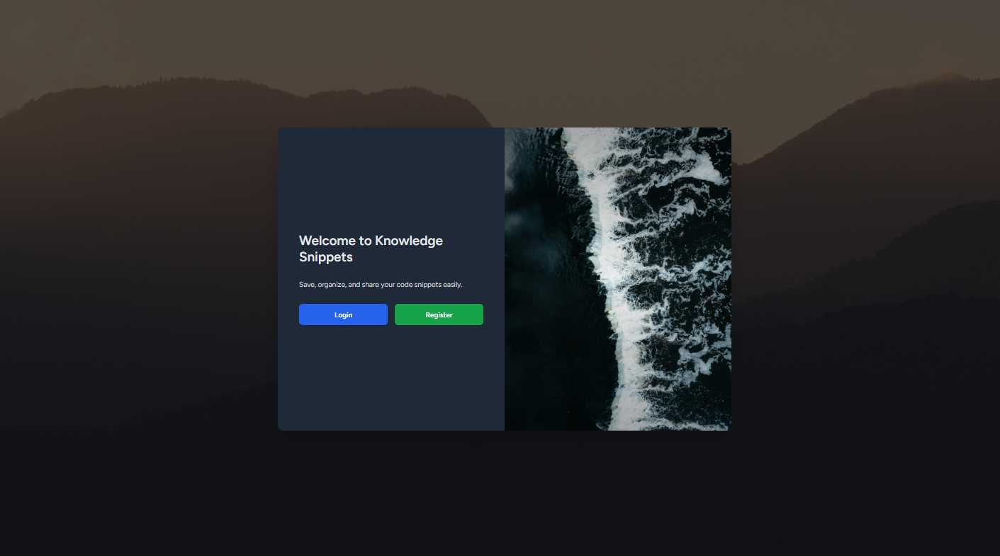
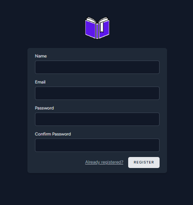
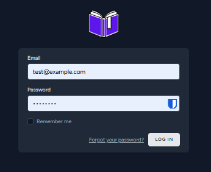

# Developer Knowledge Snippet Manager

A modern, full-featured code snippet management system built with Laravel 12 and Livewire 3, designed to help developers store, organize, search, and reuse knowledge efficiently with a fast, reactive user experience.

# Why This Project Exists

Developers constantly save useful code snippets across notes, chats, and scattered files, making them difficult to search, reuse, or share later.

This project solves that problem by providing a centralized, searchable, and tag-based snippet manager with real-time validation, syntax highlighting, strong authorization rules, and performance-focused architecture.

It was built to explore complex Livewire-driven UIs, clean backend architecture, and production-ready Laravel patterns.
# Features

## Core Features

- Create & Manage Snippets – Write, edit, and organize code snippets
- Code Highlighting – Syntax highlighting for 200+ languages using CodeMirror and Highlight.js
- Smart Tagging – Autocomplete-based tag system for easy categorization
- Advanced Filtering – Search by title, language, tags, and visibility
- Public / Private Control – Share snippets publicly or keep them private
- Like/Upvote System – Like public snippets and discover the most popular ones
- Export Options – Download snippets as JSON or PDF

## Technical Highlights

- Livewire 3 – Reactive UI without custom JavaScript
- Real-time Validation – Instant feedback with visual indicators
- Dark Mode Support – Fully implemented across all components
- Mobile Responsive – Optimized for all screen sizes
- Performance Optimized – Laravel Octane with Swoole
- Database Optimization – Indexing, eager loading, and N+1 query prevention

## Screenshots

<p float="left">
  
  
   

</p>
<p float="left">
  
  
  
</p>
<p float="left">
  
  
  
</p>

# Project Structure
```
app/
├── Http/
│   ├── Controllers/
│   ├── Middleware/
│   └── Requests/
├── Livewire/
│   ├── SnippetsIndex.php
│   ├── MySnippets.php
│   ├── CreateSnippet.php
│   ├── EditSnippet.php
│   ├── TagAutocomplete.php
│   └── DeleteSnippet.php
└── Models/
    ├── Snippet.php
    ├── Tag.php
    └── User.php

resources/views/
├── livewire/
│   ├── snippets-index.blade.php
│   ├── my-snippets.blade.php
│   ├── create-snippet.blade.php
│   ├── edit-snippet.blade.php
│   ├── tag-autocomplete.blade.php
│   └── delete-snippet.blade.php
└── snippets/
    ├── index.blade.php
    ├── my.blade.php
    ├── create.blade.php
    └── edit.blade.php
```

# Livewire Components Overview

1. **SnippetsIndex**
   - Lists all public snippets and the authenticated user's snippets
   - Search by title
   - Filtering by language, tags, and visibility
   - Pagination
   - Bulk export
   - Delete with confirmation

2. **MySnippets**
   - Displays only the authenticated user's snippets
   - Same filtering and pagination
   - Private snippet management

3. **CreateSnippet**
   - Snippet creation form featuring:
   - CodeMirror integration
   - Real-time validation with visual indicators
   - Tag autocomplete
   - Language selection

4. **EditSnippet**
   - Edit existing snippets
   - Pre-filled form
   - Authorization checks
   - Delete with confirmation

5. **TagAutocomplete**
   - Reusable component providing:
   - Real-time tag suggestions
   - Add/remove tag functionality

6. **DeleteSnippet**
   - Confirmation modal for deletion
   - Authorization verification
   - Dark mode compatible UI

7. **LikeSnippet**
   - Like/upvote button for public snippets
   - Displays total likes count
   - Toggle like/unlike with visual feedback
   - Only authenticated users can like snippets
   - Each user can like a snippet only once
   - Real-time update of like status

8. **SaveSnippet**
   - Save/bookmark button for public snippets
   - Toggle save/unsave with a single click
   - Visual bookmark icon with saved state
   - Only authenticated users can save snippets
   - Each user can save a snippet only once
   - Saved snippets accessible on dedicated page

# Like System

The application includes a comprehensive like/upvote system for public snippets:

- **Like Public Snippets** – Authenticated users can like publicly shared snippets to show appreciation
- **One Like Per User** – Database constraint ensures each user can like a snippet only once
- **Like Count Display** – Each snippet displays the total number of likes
- **Like-Based Sorting** – Snippets can be sorted by most liked to discover popular code
- **Visual Feedback** – Like button changes appearance when liked (filled heart icon and red color)

## Like Features

- Toggle like/unlike with a single click
- Like count updates in real-time
- Like button only appears on public snippets
- Unlike reverts the like with one more click
- Dashboard view includes "Most Liked" sorting option for both public and personal snippets

# Dashboard

The dashboard provides a comprehensive overview and quick access to key information:

## Two-Column Layout

- **Left Column: Top Snippets** – Displays the 5 most-liked public snippets ranked by likes
  - Ranked with badge numbers (1-5)
  - Shows title, language, tags, and description
  - Displays author, like count, lines of code, and creation date
  - Quick save and view buttons for each snippet
  
- **Right Column: Top Contributors** – Shows the 5 most active contributors
  - Ranked by number of public snippets created
  - Displays contributor name and email
  - Shows count of public snippets contributed

## Dashboard Features

- Real-time ranking based on likes and contributions
- Responsive two-column layout (single column on mobile)
- Quick access to popular content and top community members
- Save button to bookmark interesting snippets directly from dashboard

# Saved Snippets

Users can save and bookmark public snippets for quick access later:

## Save Functionality

- **Save Button** – Appears on all public snippets with a bookmark icon
- **Visual Feedback** – Icon fills when saved, shows "Saved" text
- **Dedicated Page** – View all saved snippets on the "Saved Snippets" tab
- **Full Features** – Like, export, and view saved snippets
- **Private Collection** – Each user's saved snippets are completely private
- **One Save Per Snippet** – Database constraint ensures each user can only save a snippet once

## Save Features

- Toggle save/unsave with a single click
- Saved snippets appear in chronological order (newest first)
- Full snippet details including code, tags, and description
- Export saved snippets as JSON or PDF
- Combined view with both saved and liked snippets in convenient location


All features require authentication. Authorization checks:
- Users can edit and delete only their own snippets
- Public snippets are visible to all authenticated users
- Private snippets are visible only to their owner
- Any authenticated user can create tags
- Any authenticated user can like public snippets

# API Endpoints

The application provides a RESTful API with token-based authentication (Laravel Sanctum).

## Authentication Endpoints

### Login
```http
POST /api/login
Content-Type: application/json

{
  "email": "user@example.com",
  "password": "password"
}
```

**Response (200 OK):**
```json
{
  "message": "Login successful",
  "token": "1|abcdef...",
  "user": {
    "id": 1,
    "name": "John Doe",
    "email": "user@example.com"
  }
}
```

### Logout
```http
POST /api/logout
Authorization: Bearer <token>
```

**Response (200 OK):**
```json
{
  "message": "Logout successful"
}
```

## Authenticated Endpoints

All endpoints below require `Authorization: Bearer <token>` header.

### List User's Snippets
```http
GET /api/snippets
```

### Get Snippet Details
```http
GET /api/snippets/{id}
```

### Create Snippet
```http
POST /api/snippets
Content-Type: application/json

{
  "title": "Example Snippet",
  "language": "php",
  "code": "<?php echo 'Hello'; ?>",
  "is_public": true
}
```

### Update Snippet
```http
PUT /api/snippets/{id}
Content-Type: application/json

{
  "title": "Updated Title",
  "language": "php",
  "code": "<?php echo 'Updated'; ?>",
  "is_public": true
}
```

### Delete Snippet
```http
DELETE /api/snippets/{id}
```

## Public Endpoints

These endpoints do not require authentication.

### List Public Snippets
```http
GET /api/public/snippets
```

### Get Public Snippet by Slug
```http
GET /api/public/snippets/{slug}
```

## API Testing

The project includes comprehensive API tests in `tests/Feature/AuthApiTest.php` and `tests/Feature/SnippetApiTest.php`.

Run API tests:
```bash
php artisan test tests/Feature/AuthApiTest.php
php artisan test tests/Feature/SnippetApiTest.php
```

Or run all tests:
```bash
php artisan test
```

# Database Schema

## snippets table
```sql
CREATE TABLE snippets (
  id bigint PRIMARY KEY,
  user_id bigint REFERENCES users(id),
  title varchar(255) NOT NULL,
  description text,
  code longtext NOT NULL,
  language varchar(50),
  is_public boolean DEFAULT false,
  created_at timestamp,
  updated_at timestamp
);
CREATE INDEX idx_user_id ON snippets(user_id);
CREATE INDEX idx_is_public ON snippets(is_public);
```

## tags table
```sql
CREATE TABLE tags (
  id bigint PRIMARY KEY,
  name varchar(255) UNIQUE NOT NULL,
  created_at timestamp,
  updated_at timestamp
);
```

## snippet_tag table
```sql
CREATE TABLE snippet_tag (
  snippet_id bigint REFERENCES snippets(id) ON DELETE CASCADE,
  tag_id bigint REFERENCES tags(id) ON DELETE CASCADE,
  PRIMARY KEY (snippet_id, tag_id)
);
```

# Technologies

- **Framework:** Laravel 12
- **Reactive UI:** Livewire 3.7.1
- **Code Editor:** CodeMirror 5.65.2
- **Syntax Highlighting:** Highlight.js 11.9.0
- **Export:** DOMPDF 3.1.1
- **Performance:** Laravel Octane + Swoole
- **Database:** MySQL 8.0+
- **Cache:** Redis
- **Styling:** Tailwind CSS
- **Frontend:** Alpine.js (via Livewire)

## Quick Start

### Prerequisites
- PHP 8.2+
- MySQL 8.0+
- Composer
- Node.js & npm

### Installation

1. **Clone the repository**
   ```bash
   git clone <repository-url>
   cd DeveloperKnowledgeSnippetManager
   ```

2. **Install dependencies**
   ```bash
   composer install
   npm install
   ```

3. **Environment setup**
   ```bash
   cp .env.example .env
   php artisan key:generate
   ```

4. **Configure database** (in `.env`)
   ```
   DB_CONNECTION=mysql
   DB_HOST=127.0.0.1
   DB_PORT=3306
   DB_DATABASE=snippet_manager
   DB_USERNAME=root
   DB_PASSWORD=
   ```

5. **Run migrations**
   ```bash
   php artisan migrate
   ```

6. **Build assets**
   ```bash
   npm run build
   ```

7. **Start the development server**
   ```bash
   php artisan serve
   ```

8. **Start Octane (optional, for production-like performance)**
   ```bash
   php artisan octane:start --workers=1
   ```

Visit `http://localhost:8000` and register a new account.


## Testing

### Manual Testing
Comprehensive testing documentation is available:
- **PHASE_6_TESTING_GUIDE.md** - 70+ test scenarios with step-by-step procedures
- **MASTER_TESTING_CHECKLIST.md** - 150+ items organized by feature
- **PHASE_6_TESTING_SUMMARY.md** - Test matrices and execution plan

### Automated Testing
Run automated test suite:
```bash
php test_livewire_e2e.php
```

Or via Tinker:
```bash
php artisan tinker < test_livewire_e2e.php
```


## Documentation

### Project Documentation
- **README.md** - This file (project overview)
- **LIVEWIRE_QUICK_REFERENCE.md** - Developer reference guide
- **SETUP_INSTRUCTIONS.md** - Detailed setup and configuration
- **DEPLOYMENT_GUIDE.md** - Production deployment steps

### Performance Documentation
- **PERFORMANCE_OPTIMIZATION_SUMMARY.md** - Optimization details
- **PERFORMANCE_QUICK_REFERENCE.md** - Performance tips
- **OCTANE_IMPLEMENTATION.md** - Octane configuration

## Configuration

### Laravel Octane (Optional)
For production-like performance testing:

```bash
php artisan octane:start --workers=1
```

View Octane config in `config/octane.php`

### Dark Mode
Dark mode is automatically detected from system preferences and can be toggled in the UI.


## Performance Metrics

Typical performance with Octane (1 worker):
- **List page load:** < 500ms
- **Create/Edit page load:** < 400ms
- **Real-time validation:** < 100ms response
- **Export small snippet:** < 1s
- **Export all snippets:** < 5s

See **PERFORMANCE_QUICK_REFERENCE.md** for optimization tips.

## Development Workflow

### Making Changes
1. Update Livewire component in `app/Livewire/`
2. Update corresponding view in `resources/views/livewire/`
3. Run tests: `php test_livewire_e2e.php`


### Adding New Features
1. Create new Livewire component: `php artisan make:livewire FeatureName`
2. Implement component logic
3. Create/update corresponding blade view
4. Add tests to test suite


## Deployment

For production deployment:
1. Follow **DEPLOYMENT_GUIDE.md**
2. Set environment to production: `APP_ENV=production`
3. Run migrations: `php artisan migrate --force`
4. Generate API docs if needed
5. Configure SSL certificates
6. Set up monitoring and logging


## Project Status

**Current Phase:** Phase 7 - Cleanup & Documentation   
**Livewire Migration:** Complete (Phases 1-6)  
**Testing Infrastructure:** Complete (Phase 6)  
**Status:** Production Ready

